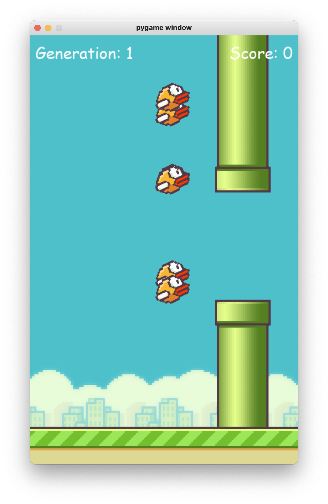

# FlappyBird Neat
## About
A self-learning AI to play the FlappyBird game, using the `neat` python module.
This project is based on [this Tech with Tim tutorial](https://www.youtube.com/watch?v=MMxFDaIOHsE&t=1s).

## Install
Runs with basic python install and a few `pip` packages:
```
pip3 install neat-python
pip3 install pygame
```

## Screenshots


## License
This work is licensed under the [MIT license](https://github.com/Red-Rapious/FlappyBird-Neat/blob/master/LICENSE).